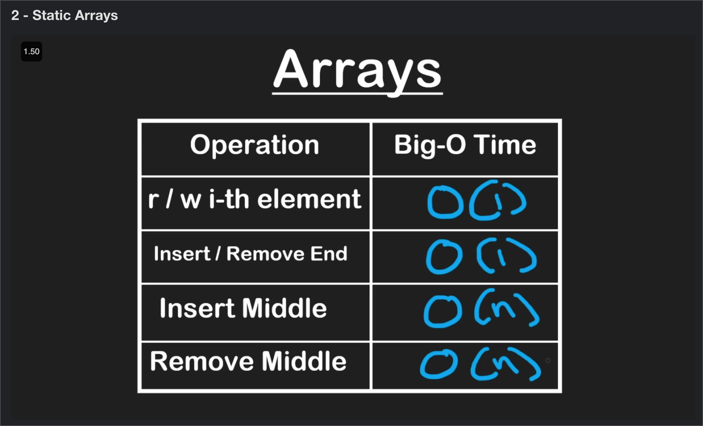

# Algorithms and Data Structures for Beginners

## Algorithms:

## Data Structures:

### Lesson 1 - Arrays

- What is RAM?
- How does RAM works?
- What is a bit?
- What is a byte?
- How to convert decimal numbers into bits?
- ASCII representation
- Why are arrays considered the most fundamental or basic data structures?
- What are "Stactic Arrays"?
- What are "Dynamic Arrays?
- What is the most notable difference between Static and Dynamic Arrays?
- What types of arrays are available in the following languages? C, C++, Java, JavaScript, Python, Go, C#?

**Time Complexity of Static Arrays common tasks: [read, write, insert, delete]**

